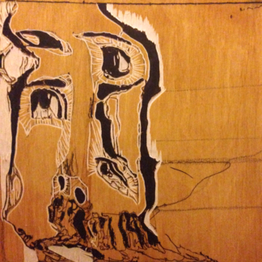

Design Questions
==============

- **How can a virtual environment could be helpful for creative work?**
- What are the obstacles in a digital driven creative process?
- What are the special need of this new type of artist?

Research
==============
This paper represents a major shifting in the direction of my thesis research. Until now I have been exploring the desktop metaphor and its implications, developing prototypes that raise the awareness of how people use computers and how they relate to them.

This paper is based on colleagues' and personal experiences around the *"creative coding"*\cite{maeda_creative_2004} practice. As the first step in a new direction this paper explores preliminary thoughts that need further research, interviews and user testing.

My departure point is an [openFrameworks](http://www.openframeworks.cc/) environment developed by *[Reza Ali](http://www.syedrezaali.com/)*, unofficially called *"the rezonator,"* used and extended by *[James George](http://jamesgeorge.org/)* and myself for the making of [CLOUDS Documentary](http://www.kickstarter.com/projects/1636630114/clouds-interactive-documentary). In it we put together an environment that fits our own needs of making interactive visual systems that could appear together with the interviews of the documentary.
These visual systems need to be self-contained, easy to embed and fit the aesthetic of the Documentary curated by the supervision of the Art Director [Bradley G. Munkowitz](http://gmunk.com/). More importantly, it should provide an efficient and powerful environment to do good work inside CG standards.

From listening to my colleagues and my own experience I start noticing that one of the biggest obstacles of *creative coding* 
relates to the double nature of the duty. There is a tension between the need to solve a logical problem while keeping a playful exploration. This could be why so many new media artists have hybrid backgrounds in-between arts and sciences. It's necessary to have tools to cope with these two universes.  

## A. Promoting flow
Csikszentmihalyi\cite{csikszentmihalyi_flow_1991} said flow can be describe as a natural fluctuation between convergent and divergent thinking, a dynamic balance between technical skills and open discovery. Like a jazz improvisation, musicians use standardized techniques and musical metrics as a structure for spontaneous collective exploration. 

Nikolaus Gansterer\cite{gansterer_drawing_2011} said something similar related to drawing: *"Since drawing can mediate between perception and reflection, it plays a constitutive role in the production and communication of knowledge"*

In most art practices we can observe a dialogue between the medium (with its technical skills) and the imagination of the author. This dialogue usually presents as a dance or fight between the material and the desire. This process of shaping something until it is done needs air; it needs a space to happen. This space has to be able to hold the anxiety of uncertainty around a creative process. It contains the indetermination of the medium until it crystallizes into a recognizable shape, while at the same time letting the gestalt of the work open enough to allow meaning to emerge. 


How does this translate to creative coding practice? In a first approach to this dilemma, I like to think that it could be solved by separating the algorithmic structure of a program from the values that it uses. This would separate the computational structure (with its convergent and logical nature), from the tweaking and playing with values (divergent aesthetic exploration). By separating these two processes into two different moments we delineate spaces that hold two different state of consciousness. Separating these moments and adding different helping elements (embedded functions and GUI elements)  will allow the artist to maintain a more effortless balance between these two ways of thinking (see Figure 1).

## B. IN and OUT from the virtual 
Contrasting with traditional artistic practices, digital creative processes tend to stay too much time in a single environment: the virtual world. The apollonian nature of computation ends up dominating the process. Generative and Glitch art tend to break this logic by bringing complexity or randomness to a procedural and highly ruled universe.
The dialog of this conversation needs to be expanded and trascended beyond the virtuality of computation. I propose that this creative process could be empowered by going out of the computer to the "real" world and back again to the computational universe. An oscillation between virtual and real, between the analog and digital. 

How can we open a highly logical virtual practice to the spontaneous rawness of analog moments? By creating opportunities for non-computational randomness, freeing the medium from its own structure, injecting the algorithm with raw and indefinite content, balancing the apollonian structure of computation with a little of our dionisiac curiousity. Like a needle passing from one side to the other side of fabric, a creative coding environment should promote connection to different sensors and actors. An ecosystem of Input/Output devices would make these transitions smooth and easy.


These transitions will become opportunities of translation and mutation of meaning, brief windows of indetermination and posible error that open the chance for expressiveness. Using this "space between" mediums the artist can participate in the process directly by filtering her own expressive nature. During this translation, some meaning gets lost and some is added.

## C. Open to others
As an expanding spiral, what begins as a dialogue between the algorithm and its values then expands to a dialogue between the digital and the analog. The last turn of the spiral is to open the dialogue between the artist and her process to other artists. 
By integrating tools into this prototyping environment that allow for documentation and shareability of work and its process, the artist can initiate a dialog with her own community. These could be simple tools like snapshots, video recording, and note-taking, along with the easy ability to upload this content to on-line social media (see Figure 3).


Project Concepts
==============
Following these three guiding concepts I have changed and expand ed the CloudsVisualSystem Environment in the following ways:

### A. Separating the Algorithm from the Values

- Breaking the CloudsVisualSystem class into three different templates: ```UI2DProject```, ```UI3DProject``` and ```UITimelineProjects```

- Constructing an abstract class call ```UIClass``` which allows new objects and their own UI to be added to the environment as modules.

- Adding extra functions to the project template for adding, saving, loading, hiding, and showing UI modules.

- Replacing all dynamically allocated UI objects for smart pointers that take care of the garbage collection.

- Standardizing color values so they're treated in HSB format for intuitive control. 

- Making native elements of colors (```aColor```) and positions (```aPoint```) with tween interpolated values, so each modification is applied progressively, making nice automatic animations when switching presets.

- Adding dragging and doubleClicking capabilities to 3D elements, such as the lights (see Figure 4).

- Adding native UI modules for several GL objects like: cameras, materials, lights, fog, shaderes and background.



## B. Easy IN/Easy Out
For this prototype I experimented with two DIY modules that are able to connect to the virtual environment and allow the user to grab or export content as part of his own creative process.

The first module is a *remote camera* using a [RaspberryPi](http://www.raspberrypi.org/) and [RaspberryCam](http://www.raspberrypi.org/camera) that takes a picture by PHP calls. After this image is requested, it is sent back to the creative coding environment. This allows the user to take pictures remotely over a wi-fi network. This module could be re-purposed in a variety of techniques such as: time-lapse, stop-motion, film recording, light painting, slit-cams, etc (see Figure 2).  
 


The second device is a *wallPlotter* powered and connected to the prototyping environment using [Arduino](http://arduino.cc/) (see Figure 4). Like the camera, this plotter is flexible enough to be re-purposed to fit in different techniques and transmedia experiments.


## C. Multiplying 

In any moment of the process the artist can take snapshots or videos of the playing work and upload them to a flickr account in order to be shared and documented (see Figure 3).


The environment has the ability to make notes inside the 3D space. Like highlighting and note-taking in a book helps to initiate a dialog between a work and a reviewer, placing 3D notes allows for a graphical way of commenting, sharing and sketching on the fly (see Figure 6). 

All these options together with the capability of switching between sketches makes this environment particularly useful for presenting work in an elegant way to others.

Next Steps
==============
On further prototypes I will research traditional and experimental studio practices searching for ways to extend and empower creative process by integrating technology. This will require a better understanding of the specific expressive capabilities of digital media, together with some experimentation on how raw materials and analog techniques could be beneficial for a creative process.

This effort will culminate in the production of an ecosystem of devices that help artists to translate between media—a collection of bridges. 