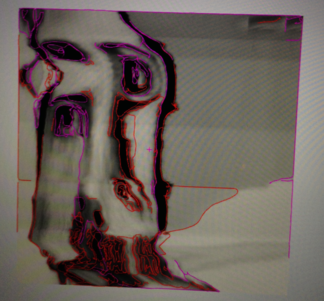
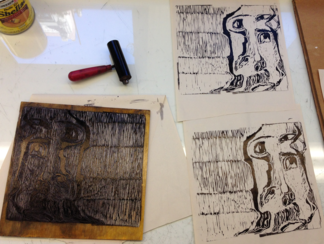

Design Questions and Concept
==============  

Three decades after Xerox/Park research and the birth of the personal computer, digital media has become part of our time. What was initially a tool for data processing slowly transformed into an expressive medium chosen by some experimental artists. As John Maeda once stated, computer technology “is not a tool; it is a new material for expression.” \cite{maeda_design_1999}

What new expressive possibilities does this medium provide? How do these technologies re-shape the creative process? The answers vary from  one artist to another. My thesis projects meditates on how technology can enhance the artist's creative environment so that she can adapt it to her own needs.

Our leading question for this journey will be a search for a vision of what the studio of the future could look like, and what type of tools we can develop to make it happen.

Research
==============
Artists have been on the technological frontier since before the Renaissance. As Greg Turner and Ernest Edmonds said, "the physical world of artifacts is very different from the conceptual world of the imagination, and artists often find themselves pushing technology forward, creating new artifacts either as part of, or in order to construct, their art. These new artifacts present new ways of using and thinking about other things.” \cite{Art03towardsa}

Most of these artifacts, which develop the creative process, end up as custom tools for expression. Some of them have become so popular that it is impossible not to relate them to an expressive field: the brush for painting, the chisel for sculpture, the type notebook for poetry. Tools blend with the author to become extensions of their body and share the process of bringing imaginations to life. That could happen by learning how to use pre-existing tools, experimenting how to use them in new ways, or by developing new ones. In the new media scene, the latter two occur often.

_"As long as you are not defined by software, you are helping to broaden the identity of the ideas that will get locked in for future generations."_ Lanier\cite{lanier_you_2010}

As we already mentioned, digital computers were developed as information machines in the early stages of what was called _**Information Society**_ (Beniger\cite{beniger_control_1986} &  Salvaggio \cite{salvaggio_information_2013}). By this, man "has come to be viewed as an active processor of information." \cite{card_psychology_1986} The tools designed for this duty are the standard digital devices that we find in offices and homes, desktop computers, printers and scanners. All of these respond to standards becoming black boxes of Inputs/Outputs.

New media artists in their search for new expressive and poetic potential make constant efforts to re-appropriate existing technology and at the same time push the limits of it into new directions.

This breaks with the passive paradigm of computer "users" to install an active attitude of creators. As Mitchel Resnick said, “computers will not live up to their potential until we start to think of them less like televisions and more like paint brushes. That is, we need to start seeing computers not simply as information machines, but also as a new medium for creative design and expression." \cite{Resnick06computeras}. Resnick emphasizes the need for turning the Information Society into a Creative Society. “The ultimate goal is a society of creative individuals who are constantly inventing new possibilities for themselves and their communities. " \cite{Resnick06computeras}

William Kentridge, a famous artist very well known for his drawings, paintings and animations, is not usually considered a new media artist, but in his work he uses a camera and a projector to construct animations. Sometimes he starts by filming himself performing different movements. Then, after editing the video, he projects it on top of a board and uses pieces of paper to animate frame by frame. In this process he incorporates both digital and analog materials. This is an excellent example of de-centralization of technology. In it, devices are reduced to a mere set of input and output devices that become part of a creative process that incorporates expressive potential from both worlds. This exquisite model of working teaches us about a flexible flow between "real" and "virtual" media, one where the artist can initialize an expansive dialog that integrates together analog and digital gestures.
 
As Klemmer and Hartmann warn us, "one of the most sweeping — and unintended — transformations that the desktop computing paradigm has brought about is the extent to which the physical performance of work has homogenized." \cite{Klemmer06howbodies} The expressive potential of our bodies is restrained by the same gestures we use for navigating the web and writing an e-mail. In order to explore new frontiers, we need to integrate the body in new ways by modifying and re-appropriating the available technology.

Michael Polanyi refers to our physical body as "the ultimate instrument of all our external knowledge, whether intellectual or practical experience is always in terms of the world to which we are attending from our body."\cite{polanyi_tacit_2009} 
In this sense, digital creative processes that successfully incorporate the richness and rawness of direct manipulation of materials will result in a larger bandwidth of poetic and expressive potential.

Project Concepts
==============

### Impetus

Make an ecosystem of devices that can be combined, adapted and re-purposed to enhance the expressive needs of artists and creators in general.

### What?

RaspberryPi is a small and cheap board capable of running a complete Linux system on it. Designed as an educative tool for children, this little board offers the possibility to easily incorporate it on an infinite variety of DIY projects thanks to a series of GPIOs (General Purpose Inputs and Outputs) and expansion slots for HD cameras. In the last month, this device has grabbed the attention of different creative and maker communities such as Scratch, PureData and openFrameworks. It has become a popular device not only for hobbyist and educational projects, but also as a host to new media art and interactive installations.

Because of this versatility and low cost, I chose the RaspberryPi as the perfect device to design a series of hardware modules and openSource programs that will become a set of creative tools. Following Mark Weiser's vision of what he call "ubiquitous computing"\cite{Weiser} this project aims to develop an ecosystem of interconnected devices designed to blend into an environment to the point of becoming invisible to the user, while at the same time, assist humans during the creative process.

I will start developing two modules (an input and an output) that will promote flow of content between digital and analog.  

- Input: a wireless camera 
- Output: a wireless wall plotter

### Why an ecosystem?
Throughout this semester, I have worked on different digital environments to promote creativity. At the end of this experience, it was clear that no digital environment in itself will assure a creative process. They become little experiments that seem to satisfy very specific needs, always with a risk of becoming prescriptive and patronizing to the user.

It is clear that whatever tool or environment I develop should be flexible and broad enough to cover both digital and analog materials together with the possibility of being easily adapted and re-purposed.

The idea is an Ecosystem not only in response to a network of devices capable of speaking with each other, but also to an adaptive set of elements (different RaspberryPi kits) that bring a framework, a common language that lets you interact with the system.

The ability of ecosystems to adapt to new scenarios is crucial to our goal of enhancing creative environments. 

### How?
This flexibility will be based not just on a modular design (based on modular hardware that is easy to install on top of the RaspberryPi), but also by providing different ways of interacting with the software. 

In the less advanced usage of the device, it will be possible to take photos or print by accessing the devices using a web interface designed in HTML/CSS and Java Script. This will make it easy and intuitive to use, especially for beginners. 

For users that already are familiarized with creative environments (scratch, processing, openFrameworks, cinder, Adobe tools, etc.) it will be possible for them to use these input/output devices through plugins. This also promotes the use of these modules inside the different communities that surround these creative frameworks.  

For those advanced users who are making their own tools, it will be possible to access a common PHP API running on top of the Apache servers inside the raspberryPi. These servers will be acting as a proxy to the native C/C++ applications, so that more advanced users can also modify or re-appropriate by modifying the open source code.

In this way, a layered software design will allow multiple access points to the devices according to the level of expertise and inner motivations of the artist. Providing for a broad spectrum of users will ease the transition from user to maker with powerful new tools.

User Scenario 
==============
Inspired by William Kentridge’s methodology, I dedicated the last month to exploring the boundaries between digital and physical tools to develop the prototype for this project.

1. I started by using the wireless camera module to make a SlitCam of myself.

2. Then I used the wireless vPlotter module to print on top of a piece of wood in order to carve it later.

3. With the wood cut finish I inked it and printed it over paper. 

A similar process could be made over fabric, plexiglass, acrylic and other materials. Also, it could be useful on printings that require bigger materials. The pen of the plotter could also be changed for a dissection-knife, laser or regular brush.

As well the wireless camera could be adapted for making stop-motions, light paintings, a video conference, a documentation tool, a time lapse and many other uses. 

The techniques or tweaks of these devices are not as important as the imagination that they can trigger. That is why the most important goal for this project is to gain the attention and enthusiasm of different communities and help them adapt these devices to their own tools and artistic practice.

Precedents
==============

Besides William Kentridge’s studio practices, I want to present other artists who have developed custom tools.

- [Jurg Lehni](http://juerglehni.com) is an interdisciplinary artist with vast experience making his own tools. A big part of his work consists of the making of drawing machines. The most famous one is [Hektor](http://juerglehni.com/works/hektor/), the first wall plotter. 

- [Anton Marini](http://vade.info/) is a VJ artist famous for his live performance, but also for being one of the developers of [Syphon](http://syphon.v002.info/), a very flexible and powerful tool for VJs and new media artist in general that let you share visual content across MacOS. This tool is broadly used and one of the reasons for that is because of the broad spectrum of communities for whom they develop plugins. They realize very clearly they essence of the tools and promote Syphon’s ability of letting you connect everything to everything else, no matter what framework you are using. I consider this a very valuable model to follow for this project. 

- [MakeyMakey](http://www.makeymakey.com/) It was not developed as a creative tool in itself. Rather, it is more like a device that is easy to plug, use and scale. It is a great example of how to present a good tool by showing different uses.

Accomplished so far
==============
- Wireless camera API (PHP)
- Wireless camera openFrameworks addon (C++)
- Wireless camera working prototype
- Wireless wall plotter API (PHP)
- Wireless wall plotter WebApp (HTML/CSS/JS)
- Wireless wall plotter console program (C/C++)
- Design of the electronic shields for the wall Plotter that mounts on top of the RaspberryPi
- Wireless wall plotter openFrameworks addon
- Wireless wall plotter working prototype

Next Steps
==============  
* Re-design the electronic shield for the wall plotter module to power the RaspberryPi and the stepper motors at the same time. 
* Design combinable enclosures for motors, the camera, and the RaspberryPi.
* Unique packaging, branding and logo.
* Documentation & Tutorials together with a video
* Design a unified style for the interfaces (UI & UX need)
* User testing: I already spoke with Katherine Moriwaki about setting up a wall plotter on D12 for public use in order to gather information and test its usage. 